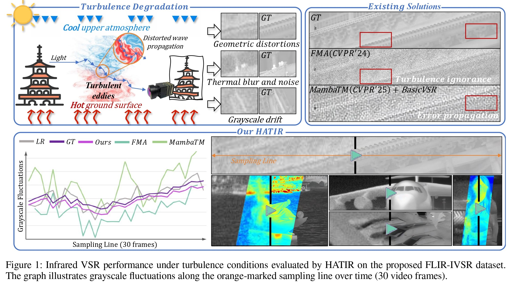
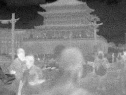
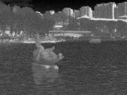
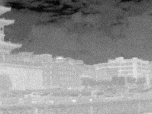

# HATIR

Yang Zou, Xingyue Zhu, Kaiqi Han, Jun Ma, Xingyuan Li, Zhiying Jiang, Jinyuan Liu, "**Heat-Aware Diffusion for Turbulent Infrared Video Super-Resolution**" (**AAAI-26 Oral**)

[](https://www.arxiv.org/abs/2601.04682)



---

<h2> <p align="center"> FLIR-IVSR Dataset </p> </h2>

## Previews

<div align="center">
  <table>
    <tr>
      <td align="center">
        
        <br />
      </td>
      <td align="center">
        
        <br />
      </td>
    </tr>
  </table>
</div>

<div align="center">
  <table>
    <tr>
      <td align="center">
        
        <br />
      </td>
      <td align="center">
        
        <br />
      </td>
    </tr>
  </table>
</div>

<div align="center">
  <table>
    <tr>
      <td align="center">
        
        <br />
        <strong>Ground Truth</strong>
      </td>
      <td align="center">
        
        <br />
        <strong>Turbulent</strong>
      </td>
    </tr>
  </table>
</div>

## Dataset Details

### Composition ($645$ sequences)

- **Camera-moving subset ($135$ sequences)**: buildings, lakes, parks, aircraft, statues, and vegetation;
- **Camera-static subset ($510$ sequences)**:
  - **Dynamic scenes ($495$ sequences)**: urban structures, pedestrian and traffic flows, crowds, individuals, lakes, and roads;
  - **Static scenes ($15$ sequences)**: buildings, vehicles, aircraft, and road environments.

- **Total number of image pairs**: $19350$

- **Image size**: $1024 \times 768$

## Download

[](https://drive.google.com/file/d/1TiWz5-xuu9LWgulpIrJe1sxadkeU4Dnu/view?usp=sharing)
[](https://huggingface.co/datasets/Ophil/FLIR-IVSR)
[](https://pan.quark.cn/s/96aa648f9d2f)

## Installation

```
git clone https://github.com/JZ0606/HATIR.git
cd HATIR

# Create a conda environment and activate it
conda env create --file environment.yaml
conda activate HATIR


# Install xformers
conda install xformers -c xformers/label/dev

# Install mmcv
mim install mmcv

# Install taming & clip
pip install -e git+https://github.com/CompVis/taming-transformers.git@master#egg=taming-transformers
pip install -e git+https://github.com/openai/CLIP.git@main#egg=clip

```

## Testing

1. Download the checkpoints for U-net, PhasorFlow and TAD from huggingface, google drive or https://pan.quark.cn/s/bfbff4f8a494
2. Modify the path to the checkpoints and the dataset path in down below:

```
  python scripts/vsr_val_ddpm_text_T_vqganfin_oldcanvas_tile.py \
  --config configs/HATIR/hatir.yaml \
  --ckpt UNET_CKPT_PATH \
  --vqgan_ckpt VQGANCKPT_PATH \
  --phasorflow PHASORFLOW_CKPT_PATH \
  --seqs-path INPUT_PATH  \
  --outdir OUT_DIR \
  --ddpm_steps 50 \
  --dec_w 1.0 \
  --colorfix_type adain \
  --select_idx 0 \
  --n_gpus 1

```

## Training

### finetune U-net

Download the pretrained Stable Diffusion models from [[HuggingFace](https://huggingface.co/stabilityai/stable-diffusion-2-1-base)], and update the ckpt_path, flownet load_path and data paths in `hatir.yaml`.

```
python main.py \
  --train \
  --base configs/HATIR/hatir.yaml \
  --gpus GPU_ID \
  --name NAME \
  --scale_lr False

```

### train PhasorFlow

Please update the ckpt_path, flownet load_path and data paths in `phasorflow.yaml`.

```
python main.py \
  --train \
  --base configs/PhasorFlow/phasorflow.yaml \
  --gpus GPU_ID \
  --name NAME \
  --scale_lr False

```

### generate data for TAD training

```

python scripts/vsr_val_ddpm_text_T_vqganfin_w_latent.py \
 --config configs/HATIR/hatir.yaml \
 --ckpt UNET_CKPT_PATH \
 --vqgan_ckpt VQGANCKPT_PATH\
 --phasorflow_ckpt PHASORFLOW_CKPT_PATH \
 --seqs-path INPUT_PATH \
 --outdir OUT_DIR \
 --latent-dir LATENT_DIR \
 --phasor-dir PHASOR_DIR\
 --flow-dir FLOW_DIR \
 --ddpm_steps 50 \
 --dec_w 1.0 \
 --colorfix_type adain \
 --select_idx 0 \
 --n_gpus 1

```

### train TAD

Please update the ckpt_path, flownet load_path, data paths and latent paths in `tad.yaml`.

```

python main.py \
 --train \
 --base configs/TAD/phasorflow.yaml \
 --gpus GPU_ID \
 --name NAME \
 --scale_lr False

```
